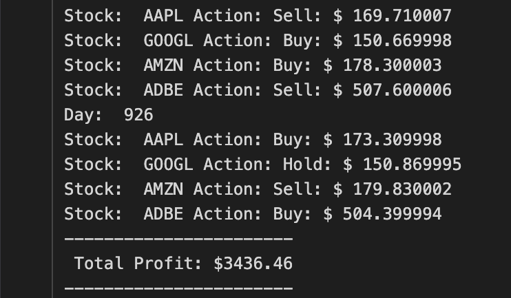

# Portfolio Builder using Reinforcement Learning

## DS251: Artificial Intelligence

The project aims to build a portfolio of stocks listed on NASDAQ using Reinforcement Learning (RL) techniques such as Deep Learning and Q Learning. The goal is to develop an intelligent system capable of making informed decisions about stock selection and portfolio allocation in order to maximize returns while managing risks effectively.

The project contains two reinforcement frameworks:

* LSTM Network Framework for prediction of individual stock prices using technical indicators.
* Q Learning Framework which takes scaled stock closing price difference as current state, with actions being 3 : buy, sit, sell. Reward being the vector containing values of individual profits.

The notebooks provide self explanatory code for understanding the processes. The predictions of the LSTM network are for 1 day in future, which are predicted using the models if available, else they are trained with default lookback period of 30 days. This is explained in [trade_agent.ipynb](trade_agent.ipynb) file. The Q learning module implemented in [portfolio_opt.ipynb](portfolio_opt.ipynb) uses DQNAgent from [agent module](agent.py), to give investment scenario for a set of stocks for 1 day in future based on the LSTM model's prediction.

### Sample Results:

##### Stock Prediction Model:

AAPL Stock Prediction using LSTM:

### Q-Learning:

Portfolio built using stocks : AAPL, AMZN, ADBE, GOOGL via Q Learning. 

### References:
[Q-Trader for skeleton training and evaluation skeleton code](https://github.com/edwardhdlu/q-trader)
[deep-q-learning for agent skeleton code](https://github.com/keon/deep-q-learning/blob/master/dqn.py)
[Code Trading's YouTube channel for LSTM idea](https://www.youtube.com/@codetradingcafe)
