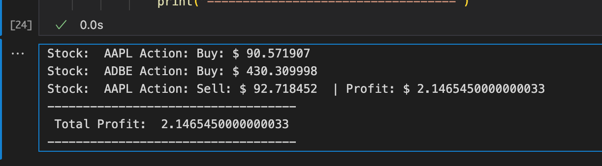

# Portfolio Builder using Reinforcement Learning

## DS251: Artificial Intelligence

The project aims to build a portfolio of stocks listed on NASDAQ using Reinforcement Learning (RL) techniques such as Deep Learning and Q Learning. The goal is to develop an intelligent system capable of making informed decisions about stock selection and portfolio allocation in order to maximize returns while managing risks effectively.

The project contains two reinforcement frameworks:

* LSTM Network Framework for prediction of individual stock prices using technical indicators.
* Q Learning Framework which takes scaled stock closing price difference as current state, with actions being 3 : buy, sit, sell. Reward being the vector containing values of individual profits.

The notebooks provide interactive code for understanding the processes.

### Sample Results:

##### Stock Prediction Model:

AAPL Stock Prediction:

### Q-Learning:

For Q-learning using stocks : AAPL, AMZN, ADBE, GOOGL

